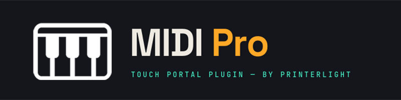

  

<h1 align="center">🎹 MIDI Pro</h1>

<strong>Professional MIDI Integration for Touch Portal</strong>

&nbsp;

&nbsp;

&nbsp;

&nbsp;

**MIDI Pro** is a professional Touch Portal plugin providing bidirectional
MIDI control, live runtime telemetry, MIDI Learn diagnostics, and touch
connectors for DAWs, synthesizers, MIDI controllers, and external MIDI
hardware.

<table>
<tr>
<td align="center">
<b>☕ Support on Ko-fi</b>  

</td>
<td width="40"></td>
<td align="center">
<b>💛 Donate via PayPal</b>  

</td>
</tr>
</table>

---

## 📋 Table of Contents

- [Platform Support](#platform-support)
- [Features](#features)
- [What's Included](#whats-included)
- [Documentation](#documentation)
- [Support the Project](#support-the-project)
- [Contact](#contact)

---

## 🚀 Platform Support

**Current Release:** RC1

| Platform | Status |
|-----------|--------|
| 🪟 Windows | ✅ Supported |
| 🍎 macOS | 🚧 In Development — build tooling is ready ([`build.sh`](build.sh)), pending a build on real macOS hardware and, for public distribution, code signing/notarization |
| 🐧 Linux | 🚧 In Development — same build tooling as macOS; blocked only on running it in a normal internet-connected environment |

---

## ✨ Features

- 🎵 Send MIDI Notes
- 🎛 Control Change (CC)
- 🔄 Relative CC
- 🎼 Program Change
- 🎚 Pitch Bend
- 🎯 MIDI Learn
- 📡 Live Runtime Telemetry
- ⚡ TX Runtime States & Events
- 🎛 Touch Sliders & Rotary Controls
- 📻 Passive MCU-style transport feedback (read-only — see [Runtime Telemetry](docs/runtime-telemetry.html#transport-states))
- 🔌 Multi-Port MIDI Support
- 🚨 Panic (All Notes Off)

---

## 📦 What's Included

- ✅ MIDI Pro Touch Portal Plugin (`.tpp`)
- ✅ Windows Host Application
- ✅ Interactive HTML Documentation Website
- ✅ User Guide (Light PDF)
- ✅ User Guide (Dark PDF)
- ✅ Markdown Documentation
- ✅ Marketplace Assets
- 🚧 Official Touch Portal Profiles *(Coming Soon)*

---

## 📚 Documentation

Choose your preferred format:

- 🌐 **[Interactive Documentation Website](./docs/index.html)** — searchable, dark/light theme, works offline
- 📄 **[User Guide (Light PDF)](./docs/MIDI_Pro_Guide_Light.pdf)**
- 🌙 **[User Guide (Dark PDF)](./docs/MIDI_Pro_Guide_Dark.pdf)**
- 📝 **[Markdown Documentation](./docs/MIDI_Pro_User_Guide.md)**

---

## ❤️ Support MIDI Pro

MIDI Pro is a free project developed in personal time. If it has improved
your workflow and you'd like to help support future development, consider
supporting the project through Ko-fi or PayPal (buttons above).

Your support helps fund:

- 🍎 Native macOS Support
- 🐧 Native Linux Support
- 🚀 New Features
- 🐞 Bug Fixes
- 📖 Documentation
- 🧪 Hardware Testing
- 🎛 Official Touch Portal Profiles
- 🎹 Future MIDI Pro Releases

Every contribution — large or small — is sincerely appreciated.

---

## 📧 Contact

**theprinterlightstudio@gmail.com**

---

Built with ❤️ by <strong>PrinterLight</strong>

