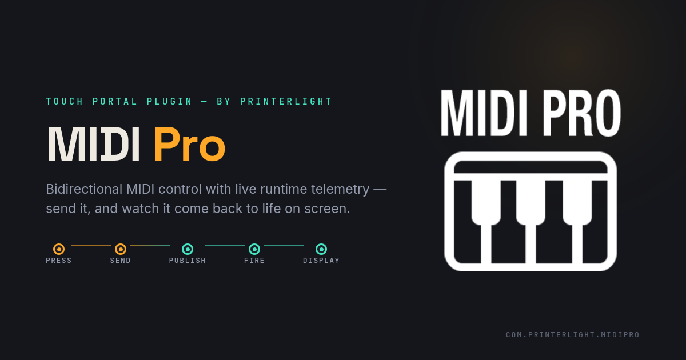

  

&nbsp;

&nbsp;

---

# 🎹 MIDI Pro

### Professional MIDI Integration for Touch Portal

**MIDI Pro** is a professional Touch Portal plugin that provides powerful MIDI control, live runtime telemetry, MIDI Learn, touch connectors, and automation workflows for DAWs, synthesizers, MIDI controllers, lighting systems, and external MIDI hardware.

---

## 🚀 Current Release

**Version:** **RC1**

The current release supports **Microsoft Windows**.

Native support for **macOS** and **Linux** is currently under development.

| Platform | Status |
|-----------|--------|
| 🪟 Windows | ✅ Supported |
| 🍎 macOS | 🚧 In Development |
| 🐧 Linux | 🚧 Planned |

---

## ✨ Why MIDI Pro?

- 🎵 Send MIDI Notes
- 🎛 Control Change (CC)
- 🔄 Relative CC
- 🎼 Program Change
- 🎚 Pitch Bend
- 🎯 MIDI Learn
- 📡 Live Runtime Telemetry
- ⚡ TX Runtime States & Events
- 🎛 Touch Sliders & Rotary Controls
- 🔌 Multi-Port MIDI Support
- 🚨 Panic (All Notes Off)

---

## 📦 What's Included

- ✅ MIDI Pro Touch Portal Plugin (.tpp)
- ✅ Windows Host Application
- ✅ Interactive HTML Documentation
- ✅ User Guide (Light PDF)
- ✅ User Guide (Dark PDF)
- ✅ Markdown Documentation
- ✅ Marketplace Assets
- 🚧 Official Touch Portal Profiles *(Coming Soon)*

---

## 📚 Documentation

Choose your preferred format:

- 📄 **[User Guide (Light PDF)](./MIDI_Pro_Guide_Light.pdf)**
- 🌙 **[User Guide (Dark PDF)](./MIDI_Pro_Guide_Dark.pdf)**
- 📝 **[Markdown Documentation](./MIDI_Pro_User_Guide.md)**
- 🌐 **Interactive Documentation** *(Coming soon via GitHub Pages)*

---

# ❤️ Support MIDI Pro

MIDI Pro is a free project developed in my spare time.

If it has improved your workflow and you'd like to help support future development, consider supporting the project through Ko-fi or PayPal.

<table>
<tr>

<td align="center">

<b>☕ Support on Ko-fi</b>  

</td>

<td width="40"></td>

<td align="center">

<b>💛 Donate via PayPal</b>  

</td>

</tr>
</table>

### 📧 Support & Contact

**theprinterlightstudio@gmail.com**

Your support helps fund:

- 🍎 Native macOS Support
- 🐧 Native Linux Support
- 🚀 New Features
- 🐞 Bug Fixes
- 📖 Documentation
- 🧪 Hardware Testing
- 🎛 Official Touch Portal Profiles
- 🎹 Future MIDI Pro Releases

Every contribution—large or small—is sincerely appreciated.

---

Built with ❤️ by <strong>PrinterLight</strong>

